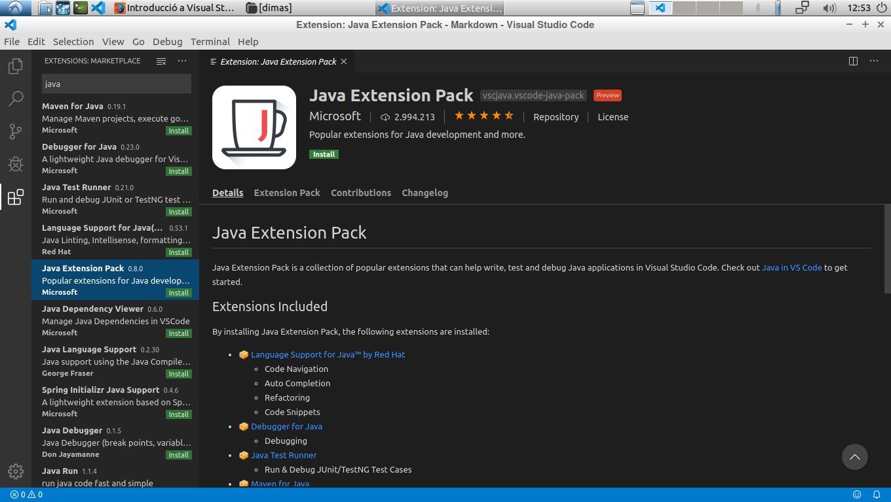

# **Memòria pràctica VSCode (instal·lació d'extensions)**
# Dimas Valls Juan

Vamos a la ventana de Extensiones y instalamos "**Markdown All in One**"

Luego instalaremos el "**Java Extension Pack**"

Y por ultimo instalaremos un tema, yo por ejemplo instalare "**Shades of Purple**"
