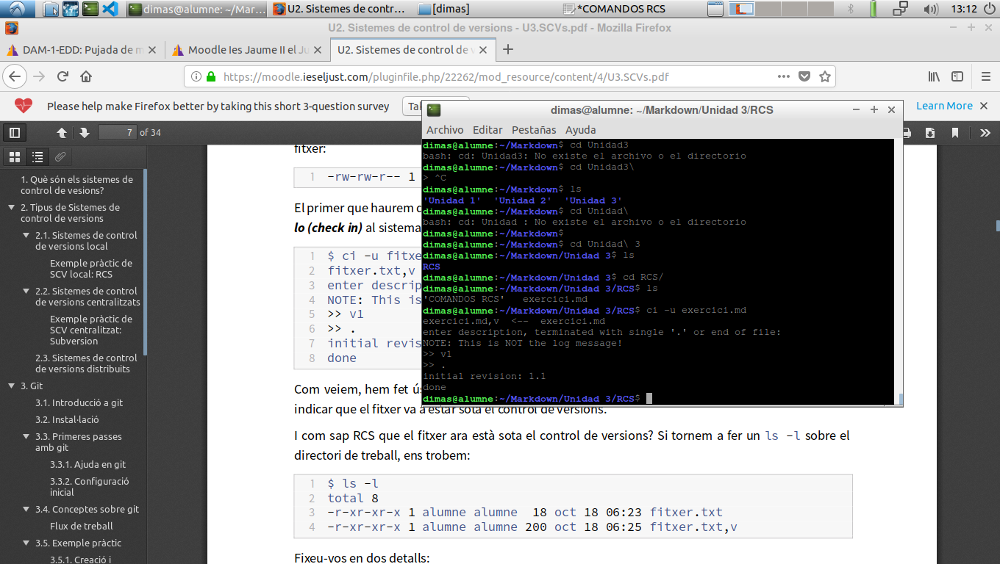

# **Memòria de l'exercici d'RCS (pàgina 10 del tema)**
# Dimas Valls Juan

Primero de todo, instalaremos los paquetes **rcs** y **rcs-blame**, mediante el comando ``sudo apt-get install rcs rcs-blame``

Luego de eso, crearemos un archivo en markdown llamado **exercici.md**

Luego, haremos un control del archivo mediante el comando ``ci -u exercici.md``

El archivo ahora esta en modo de lectura, por eso haremos un check out al fichero mediante el comando ``co -l ./exercici.md``

Ahora añadiremos otra frase al documento para probar con mas letras, luego de esto volveremos a hacer un check-in mediante el comando ``_ci -u ./exercici.md``

Ahora veremos el resultado que hemos aplicado sobre nuestro fichero mediante el comando ``rlog ./exercici.md``

Ahora veremos tanto la primera version como la segunda, mediante los comandos ``co -p1.1 ./exercici.md`` y ``co -p1.2 ./exercici.md``

Para ver las diferencias entre ambos archivos, utilizaremos el comando ``rcsdiff -r1.1 -r1.2 ./exercici.md``

Por ultimo y para finalizar, revertiremos la primera version ``co -r1.1 ./exercici.md``
