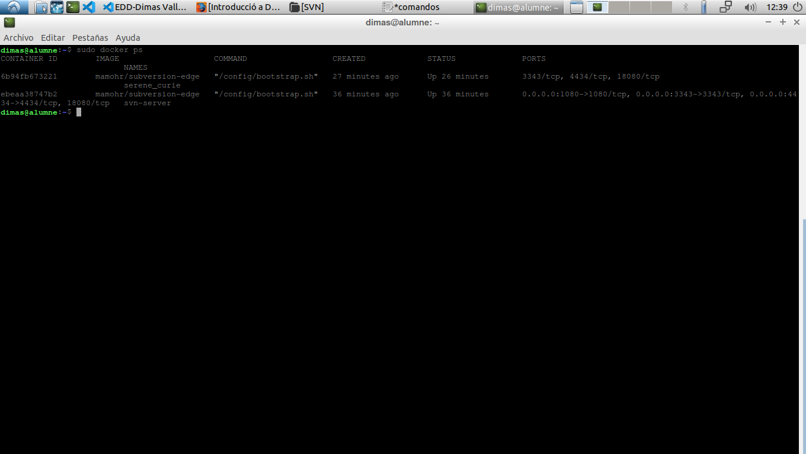
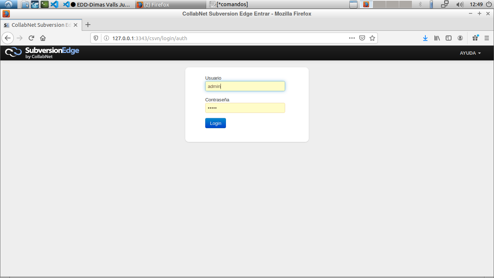

# **Memòria d'instal·lació de Subversion Edge i exercicis sobre svn**
# Dimas Valls Juan

Primero de todo instalaremos el docker mediante el comando :

``sudo apt-get install docker-ce``

La forma de iniciar el docker desde que se inicia el ordenador seria mediante el comando:

``sudo systemctl enable docker``

y para cancelar esta opcion:

``sudo systemctl disable docker``

Ahora descargaremos la imagen del Subversion desde el Docker, con el comando:

``sudo docker run -d mamohr/subversion-edge``

Con esto ya la tenemos accesible, ahora veremos los datos que tenemos con el comando:

``sudo docker ps``

Nos aparecera algo como esto:

Ahora copiaremos la id del dato que tenemos ejecutandose, y luego de esto lo pararemos y lo borraremos con los comandos:

``sudo docker stop 6b94fb673221``

``sudo docker rm 6b94fb673221``

Ahora volveremos a lanzar el dato con este comando:

``docker run -d -p 3343:3343 -p 4434:4434 -p 18080:18080  --name svn-server mamohr/subversion-edge``

Luego de hacer esto, ya deberiamos poder a la gestion del servidor poniendo la url "http://127.0.0.1:3343/" en el navegador, podriamos iniciar sesion poniendo "admin" como usuario y contraseña.

Para que podamos guardar todo lo que editemos en el servidor, tendres que poner la direccion de la carpeta donde guardar esto, colocaremos el comando:

``docker run -d -p 3343:3343 -p 4434:4434 -p 18080:18080 -v /srv/svn-data:/opt/csvn/data --name svn-server mamohr/subversion-edge``

Con esto indicaremos que la carpeta "/opt/csvn/data" sea donde se guardara toda la informacion, luego de esto ya podremos editar nuestro servidor sin problema alguno.

